# Gluon Specs

## Flows

### Bob exchages THX to USD
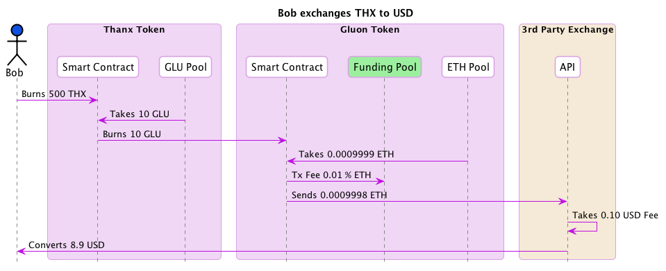

### Bob exchages THX to LOV
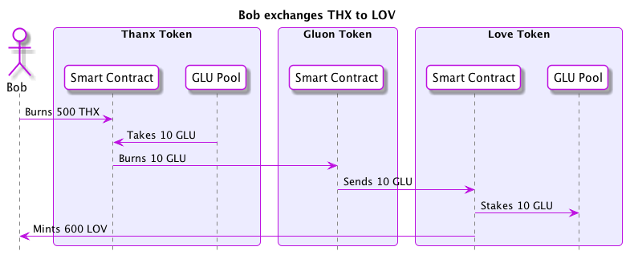

### Alice sends THX to Bob
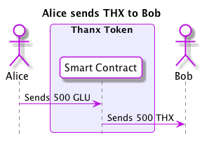

### Alice uses GLU to send THX to Bob
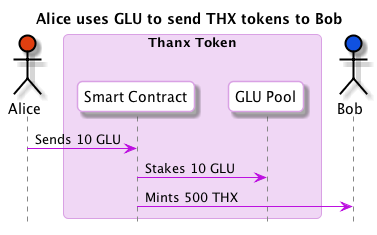

### Alice uses ETH to send THX to Bob
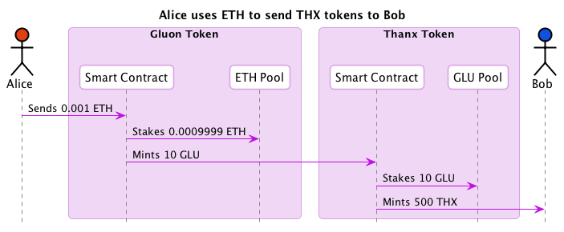

### Alice uses USD to send THX tokens to Bob
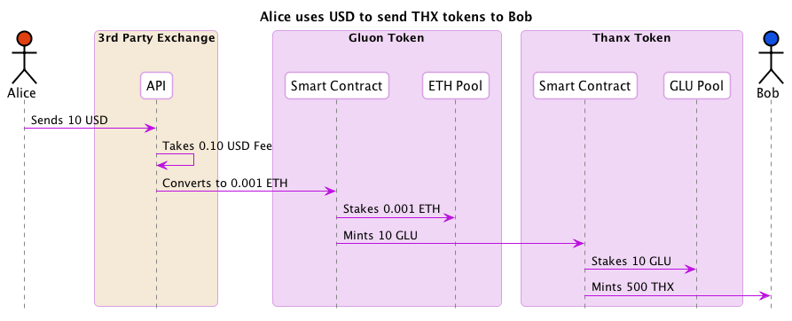

### Alice uses GLU to create LOV token

### Alice uses ETH to create LOV token
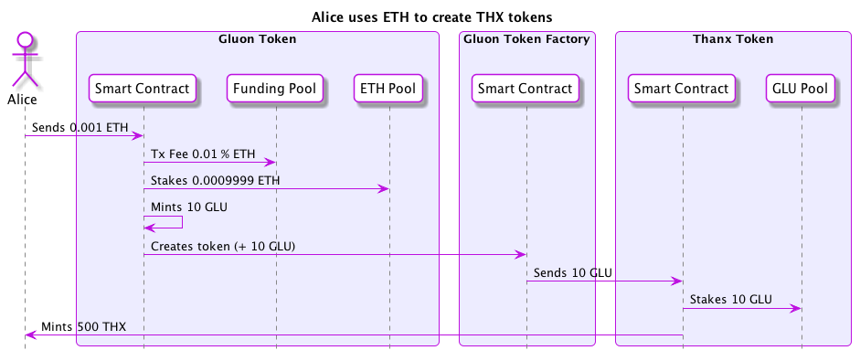

### Alice uses USD to create LOV token
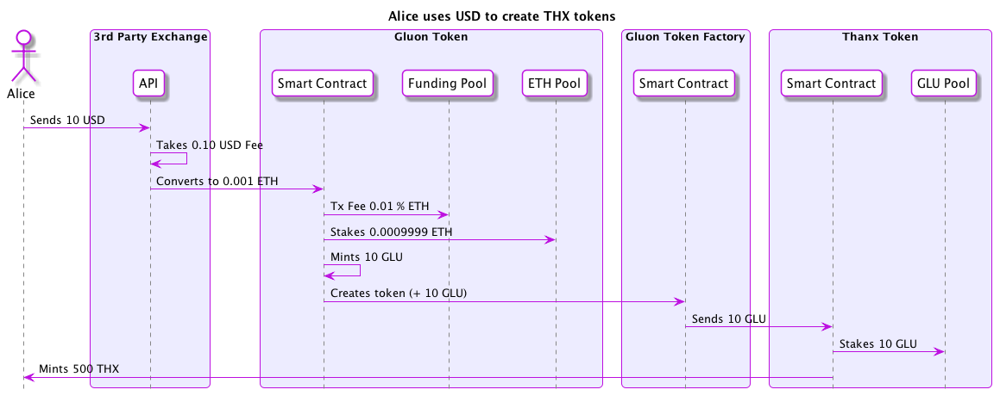

### Alice uses GLU to create THX tokens and sends them to Bob
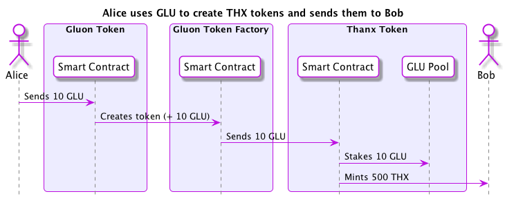

### Alice uses ETH to create THX tokens and sends them to Bob
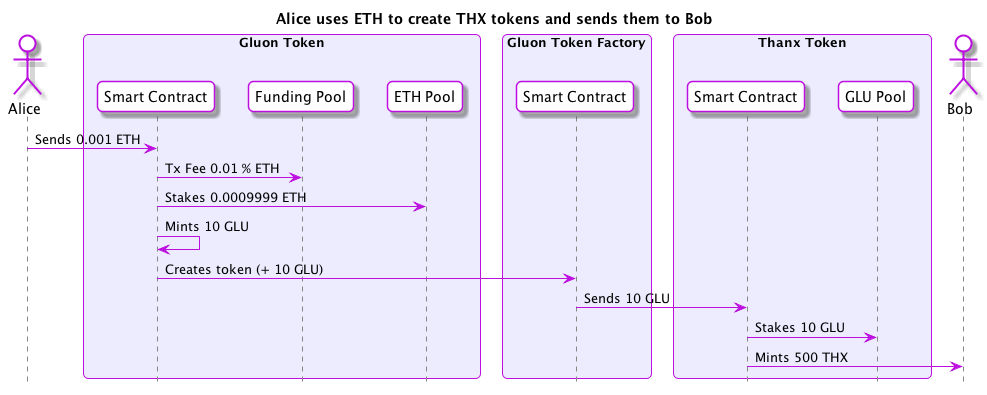

### Alice uses USD to create THX tokens and sends them to Bob
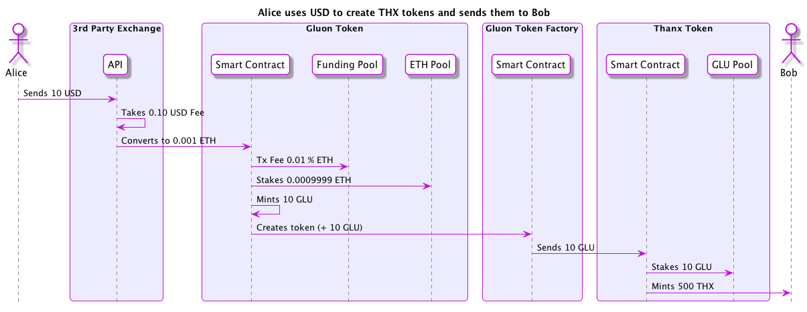

### Alice uses THX to buy LOV tokens
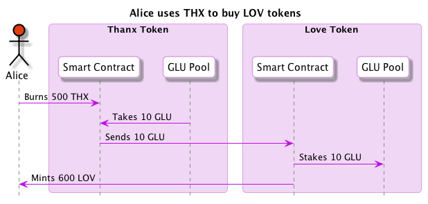

### Alice uses THX to buy LOV tokens and sends them to Bob
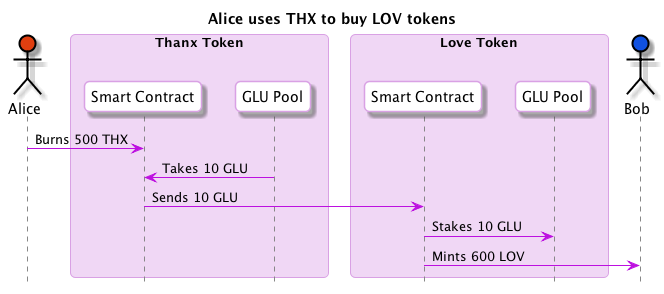

