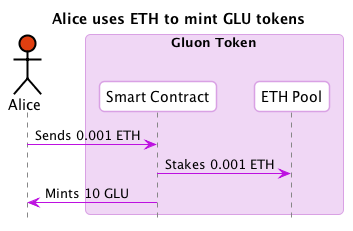
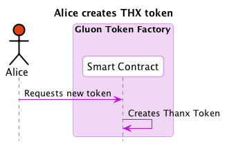
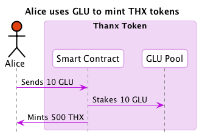

# Gluon paper

Gluon is a **social payment app** that makes it easy for users to send any token to friends and foes. Payments in the app are not just old boring transactions, rather they are media rich events which users can express themselves through. 

Gluon is **empowering communities** through custom currencies. Users can create their own tokens whose value will reflect the value of a community. 

Gluon is a **bonding curve lab** in which new bonding curve models can be tried out in real world use cases.

## Token communities

In Gluon each token is a community that shares a story. With each token transaction users can attach text, images, or other types of online media. Users will have a feed of the transfers that happens in the tokens that they follow. This fuzes the monetary aspect of the token with the social values of the community. Gluon builds on [uPort](https://uport.me) by default which provides strong identities and connects Gluon to the wider reputation environment. Token communities can be public with all events being open for everyone to view, or they can be private with the events being end-2-end encrypted and viewable only to token holders. 

## Creation of tokens

In Gluon there are two types of tokens: The Gluon token and user created tokens. The Gluon token is created and distributed using a bonding curve. User created tokens are free to create. The user that creates a token can choose its name and initial supply. After a token has been created any user can mint more of that token by a bonding curve mechanism backed by the Gluon token. 

### Bonding curves

A bonding curve is a continuous token model where the price of a token is based on how many tokens that currently exist. Tokens can be minted at any time by any user and the price is usually determined by a polynomial function inside of a smart contract. In the basic example ether is payed to a smart contract that gives you some tokens back. The ether gets locked in the contract and can be retrieved by burning tokens that have been bought previously. You can read more about bonding curves [here from Simon](https://medium.com/@simondlr/tokens-2-0-curved-token-bonding-in-curation-markets-1764a2e0bee5) and [here from Slava](https://hackernoon.com/how-to-make-bonding-curves-for-continuous-token-models-3784653f8b17). 

### Creating Gluons

The Gluon token has a continuous issuance based on a bonding curve that is backed by ether. Might be interesting to also explore using stable coins like DAI in the future. Users pay ether to the Gluon smart contract and receive Gluons back. As more ether is locked in the Gluon contract the price of Gluons increase. This increase of value indicates the value that the Gluon platform provides to all its users.
Creating user token 

One of the core functionalities in Gluon is that users can create their own tokens. Let’s say that some user creates 1000 tokens called CAT tokens, just because they like cats. This creates a standard ERC20 (most likely ERC777) token that users can send back and forth. Now a second user comes along and wants some CAT tokens, but no one wants to sell their beloved CATs. The user can then simply pay Gluons to the CAT contract and new CAT tokens are minted based on a bonding curve. The CAT economy is now backed by Gluons and the creator of CAT can potentially profit from their token. 

## The Gluon economy

In the Gluon economy tokens can be easily traded since they are all backed by Gluons. Ownership of Gluons also gives users ownership of the platform, which aligns the incentives of developers and all users.

## Getting Gluons

Users need a way of getting Gluons. We propose two ways this could be done. Buying them directly from the Gluon contract, or an exchange using ether. This is fairly straightforward but not trivial for users that are new to crypto. The other alternative is to use in-app payments to buy Gluons directly with fiat. This provides an onramp for users that are new to the crypto space.

## Financing the Gluon platform

The Gluon token platform obviously has a bunch of costs associated with its development and maintenance. Storage of media messages that are attached to token transfers, user gas cost (maybe, should users pay their own gas?), and salaries for the people building the platform. These costs could be paid for by inflating the supply of Gluon tokens in a responsible manner. This could be done programmatically by the Gluon bonding curve.

## The bonding curve lab

There are many different instances of bonding curves. All using different kind of mathematical functions, that can be parameterized in different ways. Currently we only really have intuitions about what functions will work in which scenario. The goal of the bonding curve lab is to experiment and learn from real world local and online communities when different types of curves are applicable, or if new ones needs to be designed. From this real world knowledge we aim to build an extensive knowledge base to help communities capture their value.

A bonding curve is usually some form of polynomial, e.g. y = x, y = x^2, y = x^3 etc. but can also be exponentials and sigmoids. These all have different dynamics in terms of how the price of the issued token develops. There can also be instances where the buy and sell prices are determined by different curves, where the difference is given to some beneficiary. There are also most likely other models of curved bonding that are yet to be discovered.

## Governance of Gluon

The governance of Gluon should ideally be as decentralized as possible. Things that could be governed include: new features, new bonding curves, how Gluons are issued and inflated, etc. Since users will have a stake in the system denoted in Gluons we can have a simple staking / voting mechanism for deciding and paying for new features in the system. Though initially the pragmatic path of a multisig is likely to be used, Gluon aims to plug in and use the best governance systems that the ethereum community can produce.

### Smart contract system

The aim for the Gluon smart contract system is to enable pluggable bonding curves. Token holders should be able to decide to use a different curve than the token currently uses. This is of course something that shouldn’t be done often but necessary for opening up for experimentation and avoiding stagnation.

#### Alice uses ETH to mint GLU tokens

#### Alice creates THX token

#### Alice uses GLU to mint THX tokens

#### Alice sends THX to Bob

### [Complex flows](./flows/README.md)

## Sample use cases

Below a number of sample use cases are listed. These are all communities which could benefit from using Gluon. Exactly what type of bonding curve that would fit their needs is not yet clear, but exploring this is part of the vision for the curve lab. 

### Hackerspace

Two friends have just started a hackerspace and they want a way for community members to be able to pay for the limited resources in the space, e.g. 3D-printer material, etc. They decide to create a token in Gluon. Community members now have to get the hackerspace token in order to use the limited resources. They can either get tokens from the two founders directly or buy them with Gluons. As the hackerspace gets more popular the price of the hackerspace token will increase and benefit the founders and early adopters of the hackerspace.

### Festival

A small festival needs a way of accepting digital payments for everything that happens at the festival, tickets, food stands, merchandise, etc. It creates a currency using Gluon. Since the festival tokens are issued with a bonding curve the early festival goers will have a direct incentive to both attract new festival goers but also to help make the festival better, or provide some new service in the festival area to earn festival tokens.

### An art community

A group of three art makers decide that they want to start working together to co-create projects. Though currently they don’t have a lot of funds for doing so. They therefore create a token in Gluon and start selling their individual art with only their community token. This goes well and the price of the token increases. Using this new liquidity they rent a space and exhibit their co-creations. Other artist can be inspired and also start using this currency for selling their own art, thus becoming part of the same community.
