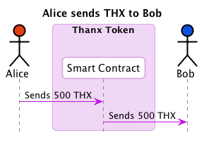
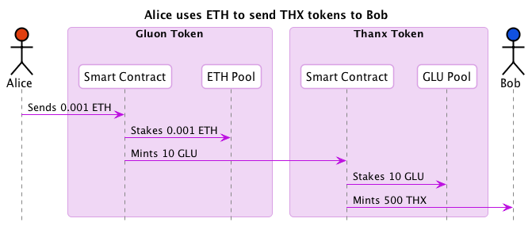
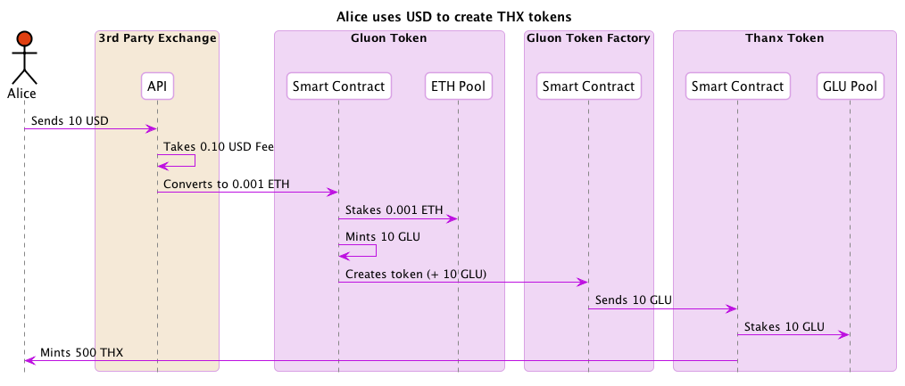
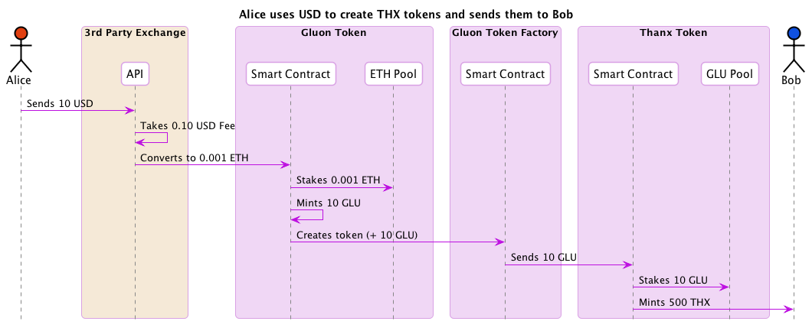

# Gluon Specs

## Flows

### Bob exchages THX to USD

### Alice sends THX to Bob

### Alice uses GLU to send THX to Bob

### Alice uses ETH to send THX to Bob

### Alice uses USD to send THX tokens to Bob

### Alice uses GLU to create THX token

### Alice uses ETH to create LOV token

### Alice uses USD to create LOV token

### Alice uses GLU to create THX tokens and sends them to Bob

### Alice uses ETH to create THX tokens and sends them to Bob

### Alice uses USD to create THX tokens and sends them to Bob

### Alice uses THX to buy LOV tokens

### Alice uses THX to buy LOV tokens and sends them to Bob

