# Flow diagrams

These examples uses these sample tokens:
  * ETH - Ether
  * GLU - Gluon token (main platform token backed by ETH)
  * THX - Thanx token (sample community token backed by GLU)
  * LOV - Love token (sample community token backed by GLU)

## Simple

### Alice uses ETH to mint GLU tokens
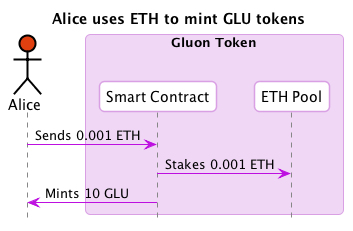

### Alice creates THX token
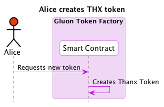

### Alice uses GLU to mint THX tokens
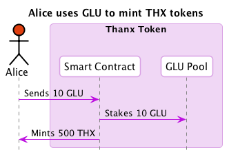

### Alice sends THX to Bob

## Complex

### Alice uses GLU to create THX token
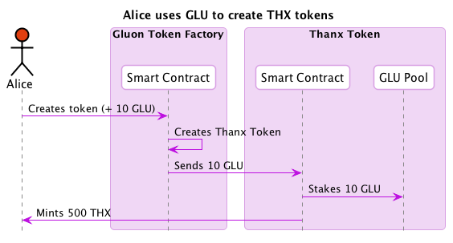

### Alice uses GLU to send THX to Bob
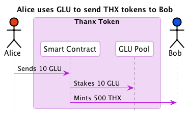

### Alice uses ETH to send THX to Bob

### Alice uses USD to send THX tokens to Bob
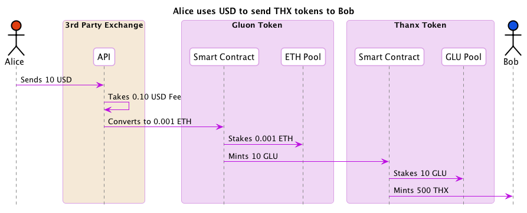

### Alice uses ETH to create THX token
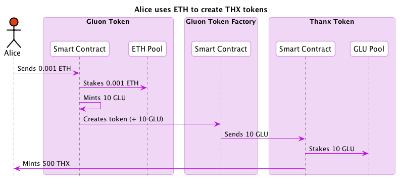

### Alice uses USD to create THX token

### Alice uses GLU to create THX tokens and sends them to Bob
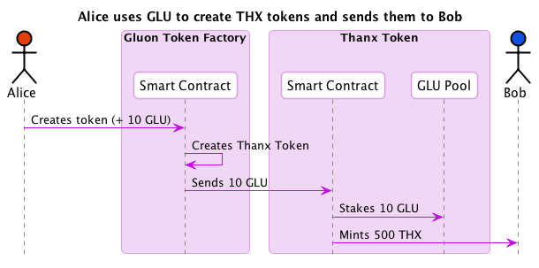

### Alice uses ETH to create THX tokens and sends them to Bob

### Alice uses USD to create THX tokens and sends them to Bob

### Alice uses THX to buy LOV tokens
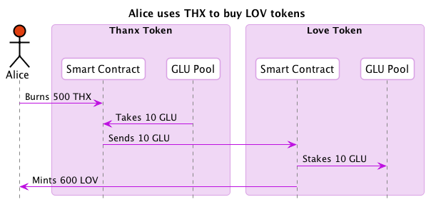

### Alice uses THX to buy LOV tokens and sends them to Bob
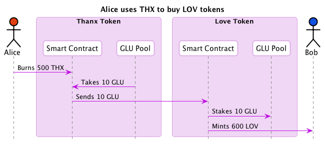

### Bob exchages THX to USD
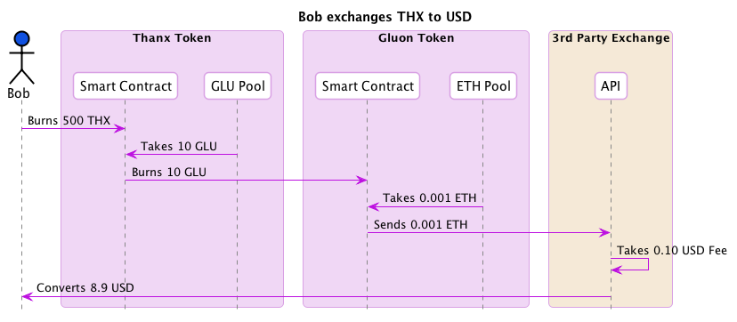
